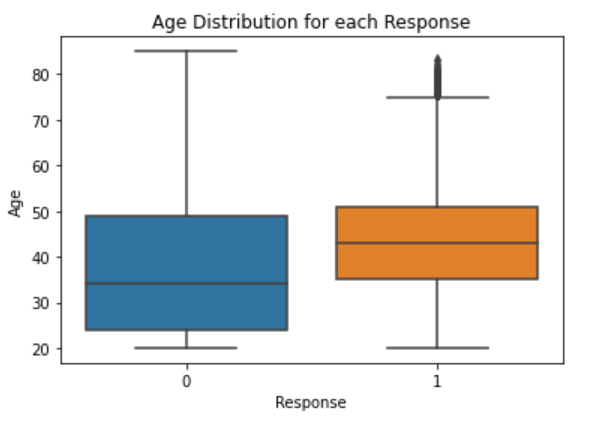
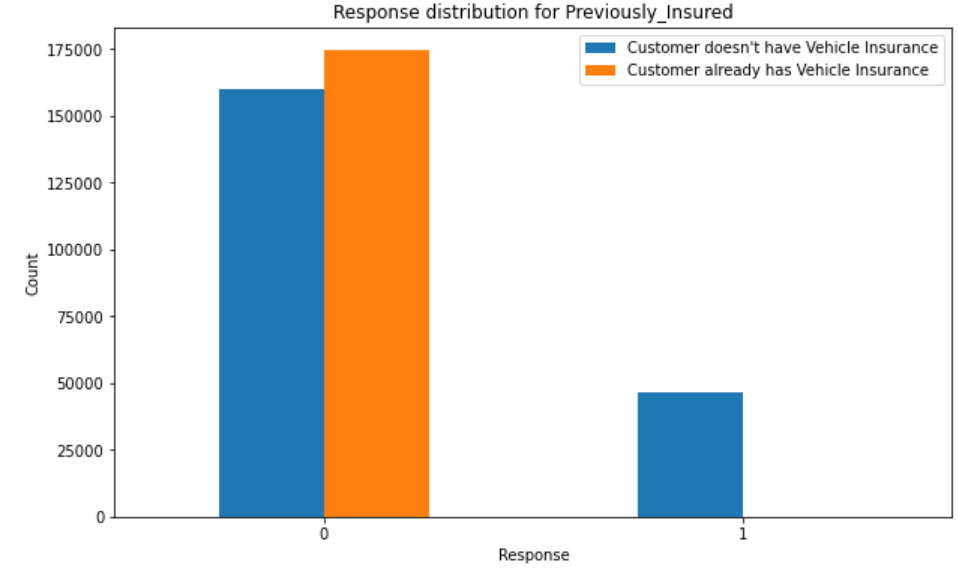
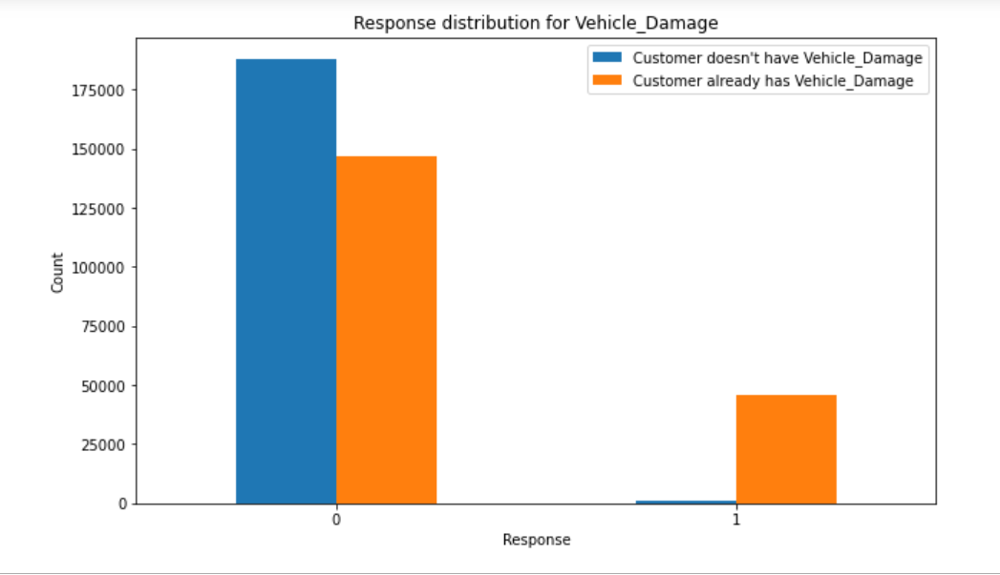

# Health Insurance Cross Sell Prediction

## Business Understanding :
An insurance company offers different types of coverage to its customers. It offers bundle
packages, which provides multiple coverage with savings to customers while the company
increases customer retention and revenue. A model that predicts whether a customer would be
interested in additional coverage is valuable information. This information could enable the
company to target the customers that are interested in additional coverage based on
demographics, optimizing its business model in terms of customer retention and revenue.
In order to capture the customers’ needs, the insurance company must be able to categorize the customers and determine the type of coverage they may be interested in. 

## Business Goals:
Building a model to predict whether a customer would be interested in Vehicle Insurance is extremely helpful for the company because it can then accordingly plan its communication strategy to reach out to those customers and optimize its business model and revenue

**Research Questions:**
*	What are the demographics of the interested customers?
*	What are the major features that make a health insurance customer interested with vehicle insurance?
*	What's the best machine Learning modeling for this Cross Sell case?
## Workflow:
- Data Understanding and Cleaning
- Exploratory Data Analysis for the initial insights
- Data Preparation
- Feature Engineering & Selection for Machine Learning Process
  -	Encoding all the categorical features
  -	Feature Selection
Model Building
*	Splitting data into Training and Testing
*	Applying the SMOTE (Synthetic Minority Oversampling Technique) to the minority target since the data is imbalance
*	Creating base model of classification algorithm 
*	Check The Evaluation matrix for all the base model
*	HyperParameter tuning
*	Checking Evaluation Matrix for tuned Model
*	Choose which model has the best recall score for this case
## Model Insights:

Gen X (age group : 30 to 45) seems to be the generation that's most likely to be  interested (21%) with vehicle insurance.

Also, the customers without any previous car insurance are more interested in getting health insurance.

It was also observed that customers with a previous car damage are more interested in getting the health insurance rather than the ones without any damage.

## Machine learning performance:
Among Logistic Regression and Random Forest, the chosen model was Random Forest. Here our focus was on Recall rather than accuracy as we wanted to reduce the False Negatives. The model was also tuned to improve the parameters due to its high recall of 90%.

## Recommendation:
*	Previously Insured and Vehicle Damage were the significant factors, so customers who had a vehicle damage in the past and had a previous vehicle insurance should be targeted
*	Using the Random Forest machine learning that has recall of 90% will speed up and evaluate customers who actually are interested in vehicle insurance, so that we could focus our resources only on the interested customers
 
